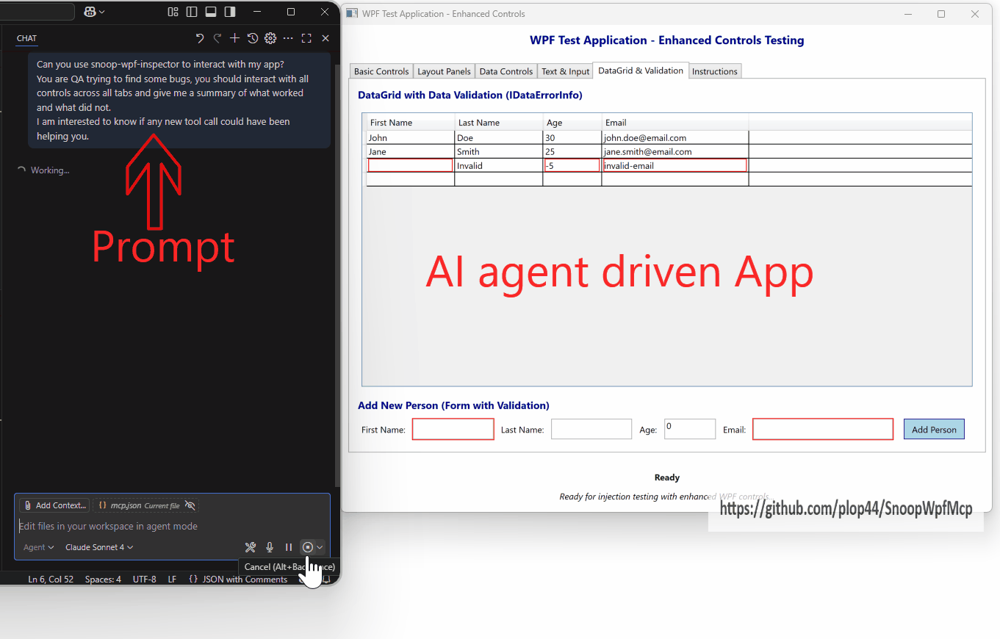

# WpfInspector MCP Infrastructure

🚧 **Work in Progress** 🚧



> **Note**: This project was "Vibe coded" (AI-assisted rapid prototyping) but it's looking very promising! 

## Overview

A Model Context Protocol (MCP) infrastructure for WPF applications using snoopwpf injection techniques. Allows code injection into running WPF processes and communication via Named Pipes.

## Quick Start

### As MCP Server
Add this configuration to your MCP client's `mcp.json`:

```json
{
    "servers": {
        "wpf-inspector": {
            "type": "stdio",
            "command": "dotnet",
            "args": [
                "run",
                "--project",
                "c:\\Users\\guenn\\source\\perso\\SnoopMcp\\MCP\\Injector\\Injector.csproj",
                "--configuration",
                "Debug"
            ],
            "env": {
                "DOTNET_ENVIRONMENT": "Development"
            }
        }
    },
    "inputs": []
}
```

## MCP Functions (KernelFunction)

### Process Discovery
- **`get_wpf_processes`**: Gets interesting WPF processes, excluding system components like explorer, TextInputHost, etc. Returns user applications and development tools that are most likely to be targets for inspection.
- **`get_process_info`**: Gets detailed information about a specific process by Process ID, including whether it's a WPF application.

### Communication & Control  
- **`ping`**: Sends a ping command to a specified WPF process (by Process ID) and returns the response. This establishes communication with the target WPF application.
- **`run_command`**: Executes a command on a specific UI element in a WPF application. Finds the element by type and hashcode, then executes the specified command. Supports various commands like CLICK, SET_TEXT, GET_PROPERTY, SET_PROPERTY, INVOKE_METHOD.

### UI Inspection
- **`get_visual_tree`**: Gets the visual tree of a WPF application as JSON. Takes a process ID as input and returns the complete UI structure including all controls, their properties, and hierarchy.
- **`take_wpf_screenshot`**: Takes a screenshot of the MainWindow of a WPF application. Finds a WPF process (by PID or name) and captures a screenshot of its main window. Returns the screenshot as base64-encoded PNG data. ⚠️ **WARNING**: This function is SLOW compared to get_visual_tree. Use get_visual_tree instead for fast inspection of UI state - only use screenshots when you specifically need the visual appearance.

## Components

- **WpfInspector**: Injected .NET library providing UI automation via Named Pipes
- **Injector**: Console app that performs injection and communicates with target process  
- **TestApp**: Simple WPF test application

## Key Features

- ✅ Process injection using snoopwpf infrastructure
- ✅ Visual tree inspection with element details
- ✅ UI element interaction (click, text input, properties)
- ✅ Screenshot capture (PNG/base64)

## Logs & Troubleshooting

- Logs: `%TEMP%\WpfInspector.log`

## License

This project is licensed under the MIT License - see the [LICENSE.md](LICENSE.md) file for details.

**Note**: This project includes SnoopWPF as a submodule, which is licensed under the Microsoft Public License (Ms-PL). See the [SnoopWPF license](snoopwpf/License.txt) for details.
